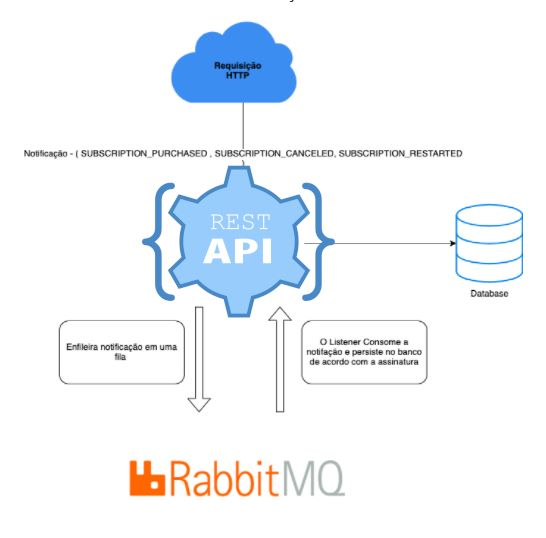
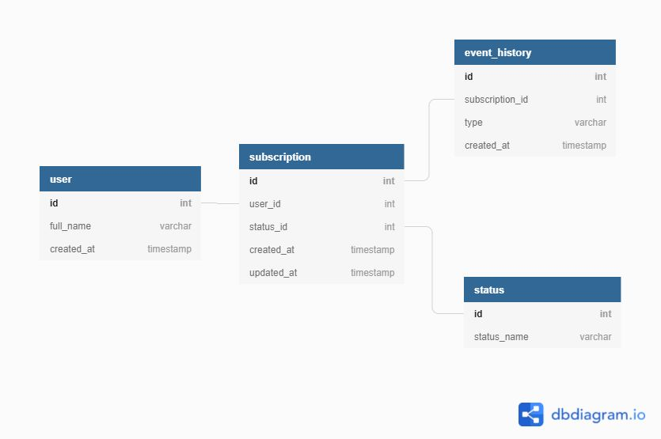

## Desafio

Desenvolver um serviço de atualização das assinaturas dos usuários. O arquiteto veio com o seguinte design para a aplicação que será desenvolvida:

<div align="center">
      
</div>

Algumas notificações foram definidas para que o serviço execute as ações sobre as assinaturas dos clientes.

Tipos de Notificações:

| Notificações             | Descrição                                                              |
| ------------------------ | ---------------------------------------------------------------------- |
| `SUBSCRIPTION_PURCHASED` | A Compra foi realizada e a assinatura deve estar com status ativa.     |
| `SUBSCRIPTION_CANCELED`  | A Compra foi cancelada e a assinatura deve estar com status cancelada. |
| `SUBSCRIPTION_RESTARTED` | A Compra foi recuperada e a assinatura deve estar com status ativa.    |

A aplicação terá o seguinte fluxo de execução:

1. Recebimento Notificação HTTP
1. Enfileiramento
1. Processamento e Persistência

## Considerações Gerais

- Você deverá versionar o projeto com a ferramenta Git de acordo com o git flow;
- Ao finalizar uma funcionalidade, por menor que seja, realize o commit e registre com uma mensagem objetiva e clara sobre as mudanças realizadas;
- Utilizaremos o histórico de versionamento para entendermos a evolução de sua aplicação (criação de features, refactores , correção de bugs e etc.)

Esse problema tem algumas requisitos não-funcionais mas obrigatórios:

- Database: Utilização de no mínimo um banco relacional;
- Seu código deverá ser multi-plataforma, ou seja, independente do SO que irá ser executado no servidor;
- Utilizar um serviço de mensageria (RabbitMQ, Apache Kafka e etc.)
- Devemos ser capazes de executar o seu código em um ambiente local de alguma forma automatizada:
- Alguns exemplos:

```bash
    # Arquivo de configuração:
    $ ./configure #(arquivo de configuração da aplicação com os comandos necessários para iniciar a mesma)
   
    # Docker:
    $ docker-compose up #(recomendado)
   
    # Comando make
    $ make run #(ou algo similar como java -jar desafio.jar)
    $ make sendNotifications
```

> Obs: Não necessariamente deve ser dessa forma, mas precisa estar automatizada e documentado.

- Devemos ter automatizadas as chamadas para a api com as notificações informadas acima, seguindo o fluxo de vida de uma assinatura (OBS: Pode ser feito utilizado algum framework para esta etapa, mas deve ser documentado sua utilização e configuração necessária).

Esses comandos devem ser o suficiente para inicializar o RabbitMQ, a aplicação e as chamadas para a API. Pode-se considerar que temos instalado no meu sistema: Java, Python, Ruby e Docker.

Qualquer outra dependência necessária deverá ser informada com antecedência (Pense que o time de Infra que irá provisionar o ambiente, então seja claro na solicitação).

_Registre tudo_: testes que forem executados, idéias que gostaria de implementar se tivesse tempo (explique como você as resolveria, se houvesse tempo), decisões que forem tomadas e seus porquês, arquiteturas que forem testadas, os motivos de terem sido modificadas ou abandonadas, instruções de deploy e instalação, etc. Crie um único arquivo COMMENTS.md ou HISTORY.md no repositório para isso.

## Modelo do Banco de Dados



## Execução

Após a inicialização do ambiente(Docker/Rabbit/Aplicação), executar o script de envio das Notificações e espera-se que o status da assinatura esteja conforme as notificações recebidas, além disso deve conter todo o histórico de notificações para cada assinatura para um possível auditoria.

O que será avaliado na sua solução?

- Seu código será observado por uma equipe de desenvolvedores que avaliarão a implementação do código, simplicidade e clareza da solução, a arquitetura, estilo de código, testes unitários, testes funcionais, nível de automação dos testes, o design da interface e a documentação.
- Consistência dos dados persistidos.

_Dicas_:

- Automatize o máximo possível;
- Aprenda o máximo possível;
- Se divirta o máximo possível;
- Em caso de dúvidas, pergunte.

# Rodando os testes

Para rodar os testes, rode o seguinte comando:

```bash
  docker-composer run web manage.py test
```

Para gerar os relatorio, rode o seguinte comando:

```bash
  docker-composer run web coverage run manage.py test
```

Para rodar os relatorio em html, rode o seguinte comando:

```bash
  docker-composer run web coverage html
```
